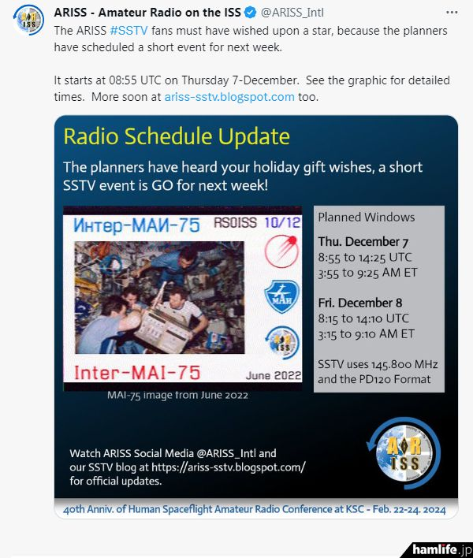

本预定于今天的ISS SSTV发射计划不出意外的出意外了，站在楼顶等了半天，一直到彻底过境也没抄收到145.800MHz的信号，倒是437.8MHz能听到微弱人声，信号报告能给到25，非常差。
这次过境本身条件是非常不错的，星等有3.7，非常亮，而且是高仰角过境，在等到时间确认方位之后直接目视引导了，唯一不好的就是ISS发挥了咕咕咕的传统艺能，把大家都给鸽了，希望明天能有发射吧。

原发射信息如下：
SSTV图像将分别于**2023年12月7日星期四（北京时间）16:55至22:25**以及**12月8日星期五（次日）（北京时间）16:15至22:10**两次从ISS（国际空间站）使用业余无线电频段（**145.80 MHz/FM**）进行图像传输，SSTV格式为 PD-120。

同时据ARISS信息，ARISS为STS-9成立40周年准备了一场SSTV活动，时间安排在12月16日 10：15 UTC-至 12 月 19 日 18:00 UTC左右，使用 PD120 格式在 145.800 MHz 上发送。

![[../../assets/img/20231207213246-sstv.png]]